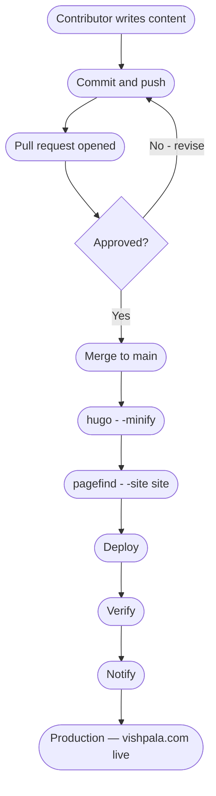

# Site Deploy Pipeline — Vishpala.com

Version: 0.1.0
Status: Draft
Style Guides: style-guide--technical-documentation-for-technologists-v0.2.0.md, web-ready-unrendered-markdown-using-apa-7-v0_2_2.md

## Abstract

This document describes the full journey from a contributor's first edit to content appearing live on vishpala.com. It covers the contributor workflow, the repository review process, and the automated build pipeline. The build pipeline is defined in `scripts/build.yaml` and executed by `scripts/build.py`. Deploy, verify, and notify stages are documented as stubs pending definition. The Mermaid diagram below maps the complete journey; each node links to the corresponding section of this document.

## Sources and Acknowledgements

Build tooling references: Hugo is maintained by [The Hugo Authors (2025)](#apa-hugo-reference). Pagefind is maintained by [Pagefind (2025)](#apa-pagefind-reference). The `hugo-tool` and `pagefind-tool` installer patterns are maintained by [Steel (2025a)](#apa-hugo-tool-reference) and [Steel (2025b)](#apa-pagefind-tool-reference) respectively.

## Pipeline diagram

## Contributor

The contributor is anyone adding or editing content on vishpala.com. This includes translators, writers, and developers. All contribution happens through the git workflow described in this section.

### Contributor writes content {#contributor-writes-content}

Content is written as markdown files placed in the appropriate language content directory under `content/<lang>/`. The directory structure mirrors the site section structure. A new page in English goes in `content/en-ca/`, a new Spanish page in `content/es/`. Frontmatter fields `title` and `description` are required. All other frontmatter fields should follow the conventions of the existing content files. See `docs/en-ca/adding-a-language-translation-v0.1.2.md` for the full content directory structure and frontmatter conventions.

### Commit and push {#commit-and-push}

When the contributor is satisfied with their changes, they commit to a feature branch and push to the remote repository. The branch name should describe the change — for example `add-es-projects-sovereign-stack` or `fix-fr-about-typo`. Commits to the `main` branch directly are not permitted. Each commit should represent a coherent unit of work. Large changes should be broken into smaller commits where possible.

## Repository

The repository stage covers everything that happens between a contributor's push and the build pipeline being triggered. This is currently a manual process.

### Pull request opened {#pull-request-opened}

The contributor opens a pull request against `main`. The pull request description should summarise what was added or changed and note any decisions the editor should be aware of. The editor reviews the content for accuracy, style, and completeness before approving.

### Approved? {#approved}

The editor either approves the pull request or requests revisions. If revisions are requested the contributor returns to the write and commit steps. If approved the pull request proceeds to merge. There is currently no automated review step — all approval is editorial and manual.

### Merge to main {#merge-to-main}

Once approved the pull request is merged into `main`. This is the trigger for the build pipeline. The merge should be a standard merge commit, not a squash or rebase, so that the full commit history is preserved. After merging, the feature branch may be deleted.

## Build pipeline

The build pipeline is defined in `scripts/build.yaml` and executed by `scripts/build.py`. Every step is declared in the YAML file so that the full sequence is visible and auditable without reading the Python. `build.py` reads the YAML, checks that required tools are available on PATH, and runs each step in the declared order, stopping with a clear error on failure.

### hugo --minify {#hugo-minify}

Hugo builds the site from source into the publish directory (`site/`). The `--minify` flag reduces the size of the output HTML, CSS, and JavaScript. Hugo must run before Pagefind because Pagefind indexes the built output, not the source. Required: Hugo extended v0.162.0 or later, available on PATH. Install via `hugo-tool`: https://github.com/steelcj/hugo-tool.

### pagefind --site site {#pagefind-site-site}

Pagefind indexes the built site and writes the search index to `site/pagefind/`. The index is served as static files alongside the site. Pagefind must run after Hugo because it indexes the HTML output in `site/`. Required: Pagefind v1.5.1 or later, available on PATH. Install via `pagefind-tool`: https://github.com/steelcj/pagefind-tool.

### Deploy {#deploy}

Not yet defined. The deploy step will transfer the built `site/` directory to the production server. See `ROADMAP.md`.

### Verify {#verify}

Not yet defined. The verify step will confirm that the deployed site is responding correctly. See `ROADMAP.md`.

### Notify {#notify}

Not yet defined. The notify step will confirm to the contributor and editor that the deploy completed successfully. See `ROADMAP.md`.

### Production {#production}

The live site at vishpala.com. Content is served by Caddy as a static site from the deployed `site/` directory. The site is available in all configured languages at their respective URL prefixes (`/en-ca/`, `/fr-ca/`, `/es/`).

## References

The Hugo Authors. (2025). *Hugo*. https://gohugo.io/
[Return to citation](#apa-hugo-citation)

Pagefind. (2025). *Pagefind*. https://pagefind.app/
[Return to citation](#apa-pagefind-citation)

Steel, C. (2025a). *hugo-tool*. GitHub. https://github.com/steelcj/hugo-tool
[Return to citation](#apa-hugo-tool-citation)

Steel, C. (2025b). *pagefind-tool*. GitHub. https://github.com/steelcj/pagefind-tool
[Return to citation](#apa-pagefind-tool-citation)

## Changelog

| Version | Status | Notes |
|---------|--------|-------|
| 0.1.0 | Draft | Initial draft — deploy, verify, and notify sections are stubs pending definition |
